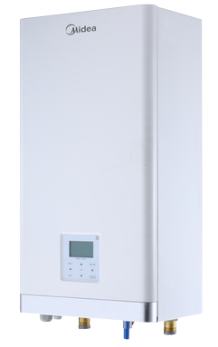
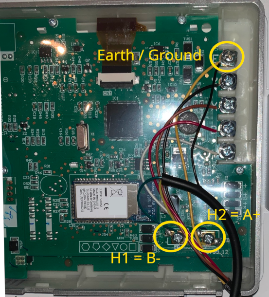
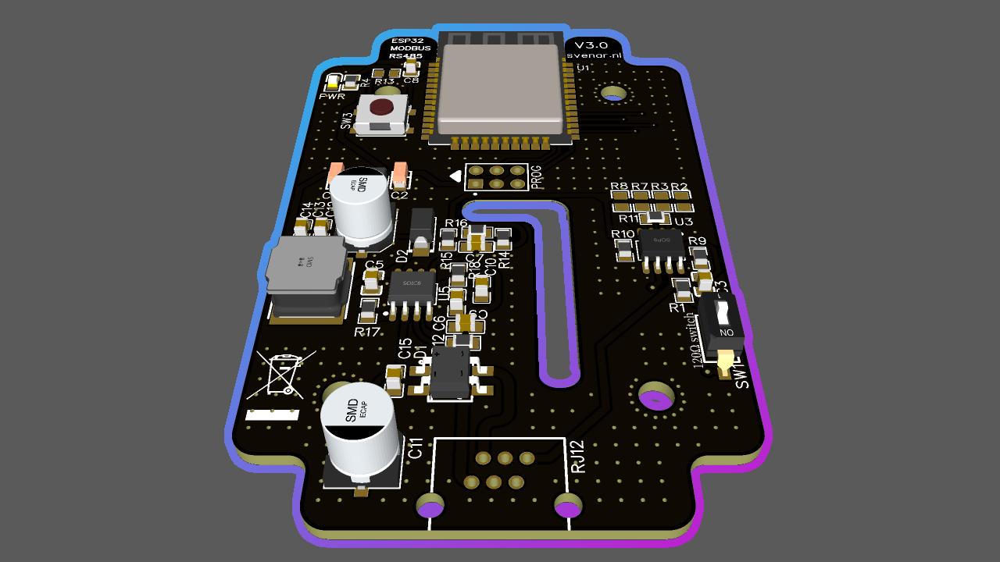
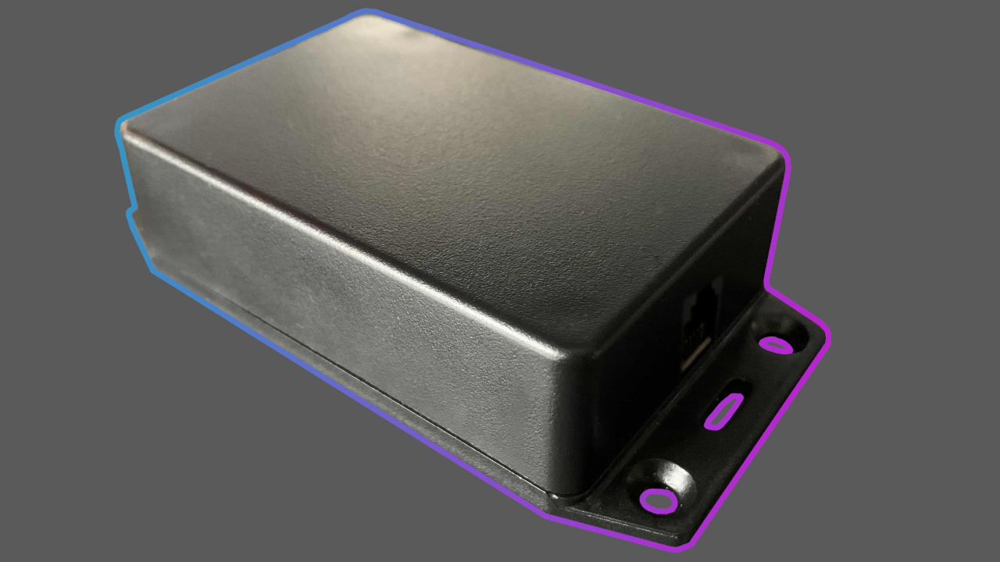

# Midea heat pump (and clones) ESPHome

The Midea heat pump and clones like [Airwell](https://www.airwell.com/en/), [Artel](https://www.artelgroup.com/products-heat-pumps/), [Ferroli](https://www.ferroli.com/int/products/hydronic-heat-pumps-cooling-heating-dhw), [Kaisai](https://www.kaisaisystems.nl), [Inventor](https://www.inventorairconditioner.com/heat-pumps-split-monoblock/split-type-heat-pumps/matrix-split-type), [Kaysun](https://www.kaysun.es/en/products-kaysun/aquantia/), [YORK](https://brsheatpumps.co.uk/products/) can be managed using the Modbus protocol. This project contains configuration file(s) which can be placed on an ESPHome enabled device to communicatie using modbus with the heat pump.

**See below for a ready-made ESPHome compatible heatpump controller!!**

## Changes between original project at 07-10-2024
Mainly i have directly connected buffer to heatpump -in winter is heated, and in summer is cooled to cool by floor and recuperation -i defined fan coil unit to be able to cool to 5deg buffer. I have other controller to pumps to get heat/cool from buffer to rest of home...

-all settings are read/write -added Register 0, 5, 210 and 211
-corrected set emission type values at register 272 to be able to set
-added COP calculated
-added uptime at s and human readable days hours min and sec
-added blinking led depends on status: wifi disconnected, connected, homeassistant connected/disconnected
-add webpanel password protected
-add product code decode
-add status of heatpump as text descibed
-added functionality to reenable Heat DHW, Zone1, Zone2 after specific time elapsed when is manually turn off -values are www or homeassistant ready to enter and switch enabling these features
-Added Some default icons for homeassistant and web interface
-Change check Heat Pump Running to check internal pump_i rather than external_pump ;)
-map PWM pump position to percent -York example move 0-480
-Commeneted some garbage:
A) reserved bits -if !secret is removed (I don't understand why... but it's me ;) ) -then is logically to remove garbage not used by most of as
B) commented statuses of more than 2 slave unit connected parallely -how many users use more than 1 heat pump ?
-Automatically set cooling mode from 1st may or heating mode on 1st october
-change for day delta T5s to 5deg and for night to 12deg -for energy save -heat often when solar production is more predicted -mean day ;)
-calculate T1s from outside temperature based on averange daily temp 

## Disclaimer

The information provided for the heat pump is intended for informational purposes only. Its use is entirely at your own risk. We do not take any responsibility for any damage or loss caused by the use of information taken from this project. We strongly recommend that you consult with a professional HVAC technician before making any changes to your heat pump configuration or installation. By using the information from this project, you acknowledge that you understand and accept these terms and conditions.

## Connect a ESPHome board to the heat pump

Connecting a device to the heat pump is not that difficult, but keep the disclaimer in mind. Before you start, disconnect the power from the indoor and the outdoor unit. Never ever open up the heat pump with the power switched on!!

A modbus device has two wires, A+ and B- and optional a ground/earth connection. The modbus device needs to be connected to the "wired controller", this is the display on the model shown.

Detach the front panel of the indoor unit (slide it up) and on the backside you will find a panel that holds the display (wired controller). Open that panel, be warned that the screws used are not alway of the best quality, so use a good fitting screw driver and be gentle.

When the panel of the display is removed, the back of the display is visible, which is a printed circuit board (PCB). On that board, search for the 'earth' connection (letter E) and connections H1 and H2. Attach the earth wire of your modbus device to the earth connection, the B- wire to H1 and A+ wire to H2.

When all is connected, place the back panel of the display back and put back the front panel of the indoor unit.

## Configuration

Place the content of the file [heatpump.yaml](heatpump.yaml) in your ESPHome device and change the `uart` and `modbus_controller` settings to your needs. The `substitutions` section can be used to change the entities name as they apear in Home Assistant. In the [homeassistant](homeassistant) directory I placed and example dashboard and some example automations.

## ESPHome Midea Heatpump Controller

Together with my son [Sven](https://svenar.nl) who is an electronics student, we created an ESPHome compatible heatpump controller for the Midea heatpump (and clones). This controller can be purchased from https://shop.svenar.nl

